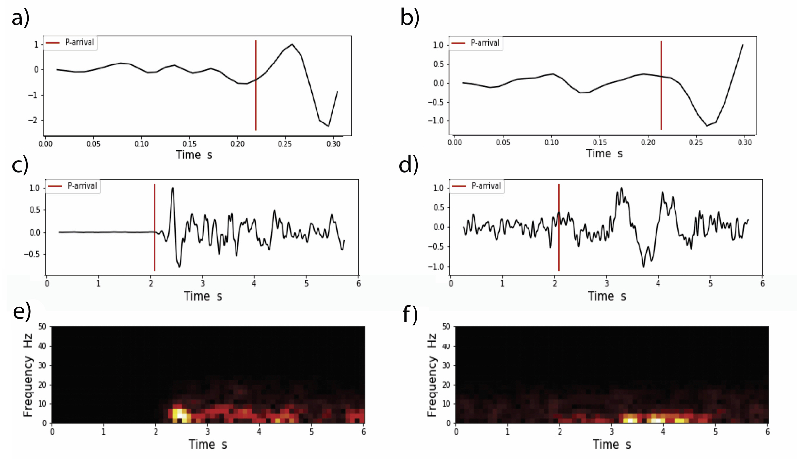
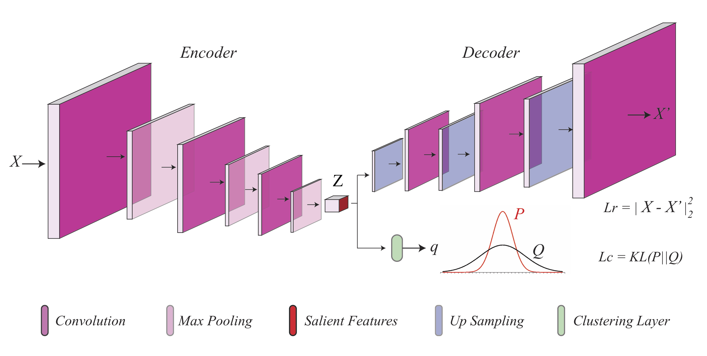
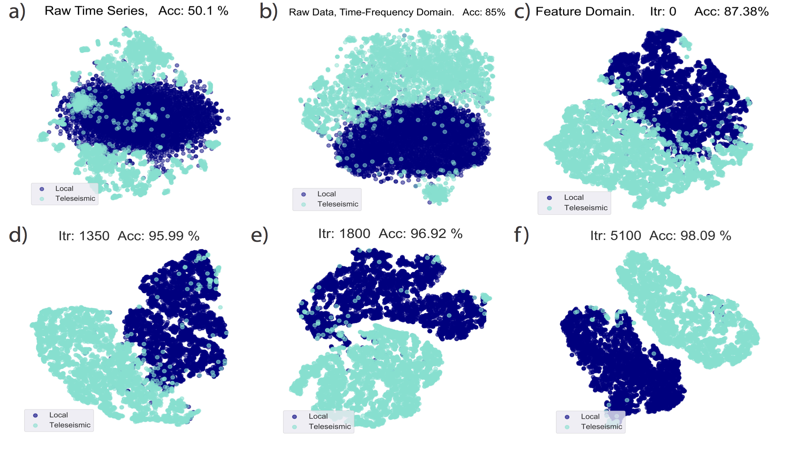
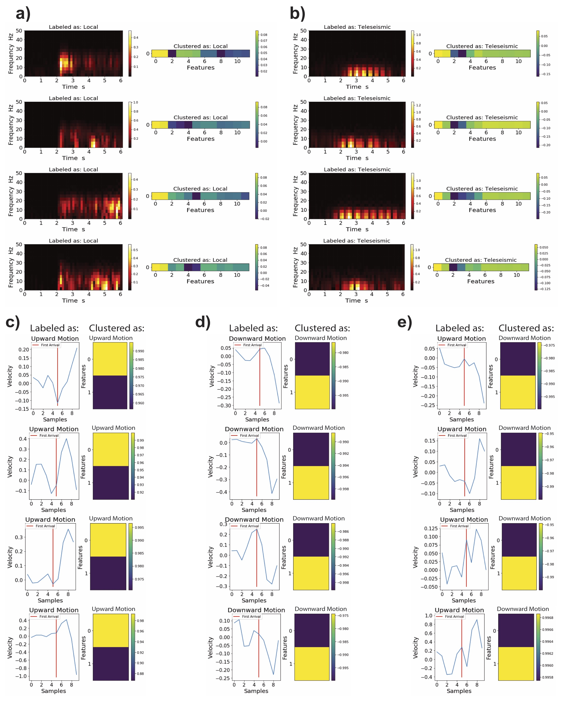
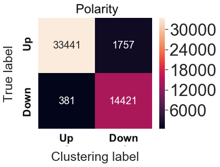
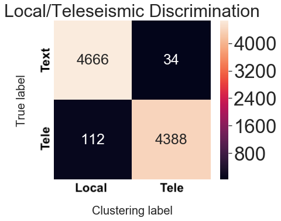

 # sample codes for paper: "Unsupervised Clustering of Seismic Signals Using Deep Convolutional Autoencoders"

Sampel data. a) and b) are two examples of the seismograms with different polarity of first motion.
c) and d) are examples of local and teleseismic waveforms respectively while e) and f) are the associated Short-Time Fourier transforms. 

The architecture of fully convolutional autoencoder used in our study. 

Clustering results. 

Visualization of embeded features. 

